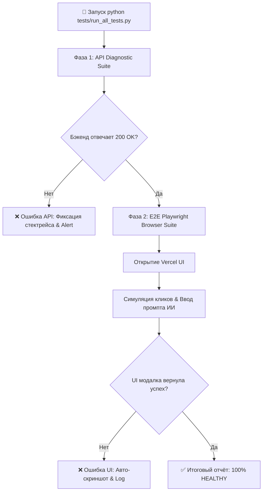

# 🧪 05. Automated Testing & Rapid Diagnostics Bible (v1.0 SoT)

Этот документ регламентирует архитектуру, алгоритмы и порядок запуска системы **автоматического тестирования и диагностики** для платформы **Revo Master Data Platform & B2B Lead Engine**.

---

## 🎯 Назначение системы тестирования

Система обеспечивает 100% покрытие ключевых пользовательских сценариев и позволяет в 1 клик выявить неработающие функции, сломанные API эндпоинты или сбои в UI до того, как с ними столкнется реальный пользователь.

### Проверяемые контуры:
1. **API Integration Test Suite (Backend & Railway):**  
   - Здоровье сервера `GET /`
   - ИИ-Стратег `POST /api/v1/ai/strategy`
   - Создание и запуск кампаний `POST /api/v1/campaigns`
   - Получение и фильтрация Master Data `GET /api/v1/leads`
   - Выгрузка отчетов `GET /api/v1/export/csv`
2. **UI & E2E Browser Test Suite (Frontend & Vercel):**  
   - Загрузка главного дашборда на Vercel (`https://apioutreach.vercel.app`)
   - Открытие и работа модального окна `AI Strategist Co-pilot`
   - Генерация стратегий без ошибок `Failed`
   - Фильтрация по гео/рейтингу и скачивание CSV

---

## 📐 Алгоритм работы авто-тестировщика (Execution Workflow)



---

## 🚀 Порядок Запуска (Quick Start)

### 1. Единый запуск всех тестов в 1 клик (Рекомендуемый способ)
Для запуска полной диагностики (API + UI) выполните команду из корневой папки проекта:

```bash
python tests/run_all_tests.py
```

### 2. Запуск только API Диагностики:
```bash
python tests/test_api_endpoints.py
```

### 3. Запуск только E2E UI Тестирования (Playwright):
```bash
python tests/test_ui_e2e.py
```

---

## 📁 Структура тестовых модулей (`tests/`)

- `tests/run_all_tests.py` — Главный оркестратор, запускает все тесты и формирует итоговый сводный отчёт.
- `tests/test_api_endpoints.py` — Проверка всех REST API ручек на Railway (`https://web-production-c4d98.up.railway.app`).
- `tests/test_ui_e2e.py` — Беспилотный Playwright браузеный кликер для тестирования Vercel фронтенда.

---

## 📊 Формат результатов диагностики

При успешном прохождении система выводит в консоль отчет вида:

```text
======================================================================
🎉 REVO DIAGNOSTIC SUITE: ALL TESTS PASSED SUCCESSFULLY!
======================================================================
[API]  GET /                      --> ✅ 200 OK (online)
[API]  POST /api/v1/ai/strategy   --> ✅ 200 OK (Strategy Generated)
[API]  POST /api/v1/campaigns     --> ✅ 200 OK (Campaign Queued)
[API]  GET /api/v1/leads          --> ✅ 200 OK (Leads fetched)
[UI]   Vercel Dashboard Load      --> ✅ OK (200)
[UI]   AI Strategist Modal        --> ✅ OK (No Error Alerts)
======================================================================
```

В случае ошибок скрипт автоматически сохраняет подробный лог и скриншот неисправного UI в папку `tests/screenshots/error_ui.png`.
